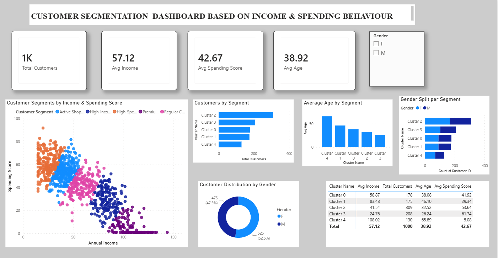

# Customer Segmentation Dashboard Based on Income & Spending Behaviour

## 📌 Project Overview

This project presents a **Business Intelligence solution for customer segmentation and personalized marketing analysis**.

The objective is to identify different customer groups based on their **Annual Income** and **Spending Score**, analyse their demographic and behavioural characteristics, and provide business insights that can support targeted marketing decisions.

The project combines **Machine Learning with Microsoft Power BI**. K-Means Clustering is used to identify customer segments, while Power BI is used to transform the clustering results into an interactive and easy-to-understand dashboard.

---

## 🎯 Objectives

- Analyse customer demographic and spending behaviour.
- Preprocess and prepare customer data for analysis.
- Apply K-Means Clustering to identify customer segments.
- Analyse customer segments based on income and spending behaviour.
- Compare customer segments using demographic and behavioural metrics.
- Build an interactive Power BI dashboard.
- Generate actionable insights for personalized marketing campaigns.
- Support data-driven customer targeting and retention strategies.

---

## 🛠️ Technologies Used

- **Python**
- **Pandas**
- **NumPy**
- **Scikit-learn**
- **K-Means Clustering**
- **Matplotlib**
- **Seaborn**
- **Microsoft Power BI**
- **CSV Dataset**

---

## 📊 Dataset

The project uses a Mall Customer dataset containing **1,000 customer records**.

### Main Attributes

| Attribute | Description |
|---|---|
| Customer ID | Unique identifier for each customer |
| Gender | Gender of the customer |
| Age | Age of the customer |
| Annual Income (k$) | Annual income of the customer |
| Spending Score (1–100) | Customer spending behaviour score |

The primary features used for customer segmentation are:

- **Annual Income (k$)**
- **Spending Score (1–100)**

These features help identify differences between customers based on their purchasing capacity and spending behaviour.

---

## 🔄 Project Workflow

```text
Customer Dataset
       ↓
Data Preprocessing
       ↓
Missing Value Handling
       ↓
Feature Selection
       ↓
K-Means Clustering
       ↓
Customer Segmentation
       ↓
Clustered Customer Dataset
       ↓
Power BI Data Integration
       ↓
Interactive Dashboard
       ↓
Business Insights
       ↓
Personalized Marketing Decisions
```

---

## 🤖 Machine Learning Approach

### K-Means Clustering

K-Means is an **unsupervised machine learning algorithm** used to group customers with similar characteristics.

In this project, K-Means clustering is applied using:

- Annual Income
- Spending Score

The model identifies **five customer segments** based on similarities in customer behaviour.

The generated cluster information is added to the customer dataset and exported as:

```text
clustered_customers.csv
```

This clustered dataset is then imported into Power BI for further analysis.

---

## 👥 Customer Segments

The five customer clusters are interpreted as the following business segments:

### 1. Regular Customers

Customers showing relatively balanced income and spending behaviour.

**Recommended strategy:**  
Loyalty rewards, personalized recommendations, and regular promotional offers.

### 2. High-Income Low Spenders

Customers with relatively high income but lower spending behaviour.

**Recommended strategy:**  
Premium offers, exclusive promotions, and personalized product recommendations.

### 3. Active Shoppers

Customers showing comparatively strong spending behaviour and representing a major customer group.

**Recommended strategy:**  
Product bundles, cross-selling, seasonal campaigns, and engagement offers.

### 4. High-Spending Value Shoppers

Customers with comparatively lower income but high spending behaviour.

**Recommended strategy:**  
Cashback offers, loyalty rewards, and customer retention programmes.

### 5. Premium Potential Customers

Customers with high income but very low current spending behaviour.

**Recommended strategy:**  
Personalized premium offers, exclusive experiences, and targeted incentives to increase engagement.

---

## 📈 Power BI Dashboard

The final dashboard is titled:

**Customer Segmentation Dashboard Based on Income & Spending Behaviour**

The dashboard provides an interactive view of customer characteristics and segment-level behaviour.

### Key Performance Indicators

| KPI | Value |
|---|---:|
| Total Customers | **1,000** |
| Average Income | **57.12 k$** |
| Average Spending Score | **42.67** |
| Average Age | **38.92 years** |

### Dashboard Components

The dashboard includes:

- **Customer Segmentation by Income & Spending Score**
- **Customers by Segment**
- **Average Age by Segment**
- **Gender Split per Segment**
- **Customer Distribution by Gender**
- **Customer Segment Summary**
- **Gender Filter**

The scatter plot provides the primary segmentation view by showing customers according to Annual Income and Spending Score, with different colours representing different customer segments.

---

## 📸 Dashboard Preview



---

## 📋 Segment Summary

| Segment | Avg Income (k$) | Customers | Avg Age | Avg Spending Score |
|---|---:|---:|---:|---:|
| Cluster 0 | 58.87 | 178 | 38.08 | 41.92 |
| Cluster 1 | 83.48 | 175 | 46.10 | 29.34 |
| Cluster 2 | 41.54 | 309 | 32.52 | 53.64 |
| Cluster 3 | 24.76 | 208 | 26.24 | 61.74 |
| Cluster 4 | 108.02 | 130 | 65.89 | 5.08 |

---

## 💡 Business Insights

The analysis demonstrates that customers with different income levels do not necessarily have the same spending behaviour.

The segmentation provides an opportunity to:

- Identify high-value customer groups.
- Recognize high-income customers with low spending.
- Identify highly active shoppers.
- Develop targeted promotional campaigns.
- Improve customer engagement.
- Strengthen customer retention.
- Allocate marketing resources more effectively.
- Support data-driven marketing decisions.

---

## 🎯 Personalized Marketing Strategy

The segmentation can be used to move from **mass marketing to targeted marketing**.

```text
Customer Segment
       ↓
Understand Customer Behaviour
       ↓
Identify Segment Characteristics
       ↓
Select Appropriate Marketing Strategy
       ↓
Personalized Offer / Campaign
       ↓
Improved Customer Engagement
```

Different customer groups can therefore receive different offers instead of receiving the same marketing campaign.

---

## ▶️ How to Run the Python Component

### 1. Install Python

Make sure Python is installed on your system.

### 2. Install Required Libraries

```bash
pip install -r requirements.txt
```

### 3. Run the Segmentation Program

```bash
python customer_segmentation.py
```

### 4. Output

The program generates:

```text
clustered_customers.csv
```

The generated clustered dataset can then be imported into Microsoft Power BI.

### 5. Open the Dashboard

Open:

```text
Customer_Segmentation_Dashboard.pbix
```

using **Microsoft Power BI Desktop**.

---

## 📁 Project Structure

```text
Mall-Customer-Segmentation/
│
├── customer_segmentation.py
├── Mall_Customers.csv
├── clustered_customers.csv
├── Customer_Segmentation_Dashboard.pbix
├── requirements.txt
├── README.md
│
└── screenshots/
    └── dashboard.png
```

---

## 🚀 Future Enhancements

- Compare K-Means with other clustering algorithms.
- Determine the optimal number of clusters automatically.
- Integrate customer transaction history.
- Add purchase frequency and recency features.
- Develop customer spending prediction models.
- Build a product recommendation system.
- Integrate real-time customer data.
- Deploy the solution as a web-based analytics application.

---

## 📌 Conclusion

This project demonstrates the integration of **Machine Learning and Business Intelligence** for customer behaviour analysis.

K-Means Clustering is used to identify meaningful customer segments based on income and spending behaviour, while Microsoft Power BI provides an interactive platform for analysing these segments.

The resulting insights can help businesses understand their customers, identify marketing opportunities, create personalized campaigns, improve customer engagement, and make more informed data-driven decisions.

---

## 👩‍💻 Author

**Yerragudi Abhi Nandhana**

B.Tech – Computer Science and Engineering  
Artificial Intelligence
